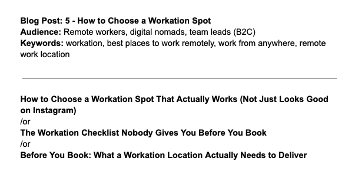

Kim są ludzie, którzy szukają miejsca na workation? Freelancerzy, programiści, pracownicy korporacji – osoby, które łączą zobowiązania zawodowe, napięte terminy i ograniczony czas na odpoczynek. To goście, którzy szukają czegoś więcej niż zwykli turyści – przestrzeni pozwalającej znaleźć równowagę między produktywnością a relaksem i regeneracją. Aby ich przyciągnąć, nie wystarczy już wygodne łóżko i czysta łazienka. Potrzebne jest miejsce, które wspiera pracę, a jednocześnie pozwala naprawdę odpocząć.

Kawa na tarasie z widokiem na góry lub morze, szybki rzut oka na e-maile i poranna telekonferencja w pełnym skupieniu – tak wygląda poranek współczesnego pracownika kreatywnego czy specjalisty IT.

## Koncentracja i regeneracja oraz poczucie spokoju

Aby miejsce, które oferujesz, stało się tym, do którego goście chcą wracać, powinno być gotowe do pracy od momentu przekroczenia progu, bez konieczności konfigurowania przestrzeni pod kątem codziennych obowiązków. Hałas, brak dostępu do prądu w dogodnym miejscu czy chwiejący się stół, który trzeba stabilizować prowizorycznymi rozwiązaniami, nie sprzyjają efektywnej pracy. Dlatego warto zacząć od podstaw — najpierw funkcjonalność i komfort, a dopiero potem estetyka.

## Strefa do pracy zamiast „kącika"

**Internet.** Absolutnie pierwszy na liście. Obok prądu to podstawowe medium – bez niego nie ma pracy. Musi działać stabilnie, co w lokalizacjach „z dala od wszystkiego" nie zawsze jest oczywiste. W opisie oferty warto dodać realne parametry łącza (np. wyniki speedtestu), aby jasno pokazać, że traktujesz workation poważnie.

**Biurko.** Postaw na stabilną konstrukcję. Nie musi to być klasyczne biurko — sprawdzą się również rozwiązania z obrobionego drewna lub z recyklingu (np. starych drzwi), o ile tylko są solidne. Ważne, aby blat był wystarczająco duży (około 120 cm) i pomieścił laptopa, kubek kawy, lampkę i notatnik.

**Krzesło.** Powinno być wygodne i ergonomiczne. Unikaj najtańszych modeli lub takich, które dobrze wyglądają, ale szybko tracą stabilność i zaczynają skrzypieć. Zamiast wspierać pracę, będą źródłem frustracji.

**Oświetlenie.** Najlepsze do pracy w ciągu dnia jest naturalne światło, dlatego biurko powinno znajdować się w pobliżu okna – najlepiej z możliwością regulacji oświetlenia. Po zmroku niezbędna jest lampka stołowa lub podłogowa, a jedynym źródłem światła nie powinien być centralny żyrandol. Unikaj ostrego, „szpitalnego" światła sufitowego — postaw na przemyślane strefowe oświetlenie, inspirowane wnętrzami skandynawskimi.

**Klimatyzacja.** To element, który z luksusu staje się standardem. Jeśli nie masz stałej instalacji, warto pomyśleć o przenośnym klimatyzatorze — wiele modeli oferuje też funkcje ogrzewania, oczyszczania i nawilżania powietrza.

> ## Dodatki, które robią różnicę
>
> Dodatkowy monitor to miły bonus, za który możesz śmiało podnieść stawkę — warto tylko napisać w ofercie, jaki rodzaj złączy jest dostępny (najbardziej uniwersalny jest kabel USB-C). Zadbaj też o odpowiednią liczbę gniazdek elektrycznych w różnych miejscach pomieszczenia oraz o dobre warunki do wideorozmów: uporządkowaną przestrzeń widoczną w tle, światło doświetlające twarz, ograniczenie pogłosów i ciszę, dzięki którym gość może spokojnie prowadzić rozmowy.

## Jak strefa do pracy, to i dobra kawa

Drogi ekspres nie jest konieczny — chyba że oferujesz przestrzeń wspólną, z której korzysta więcej osób. Jeśli gość ma do dyspozycji kuchnię, warto postawić na prostsze rozwiązania, takie jak kawiarka, french press lub aeropress oraz — obowiązkowo — czajnik do gotowania wody. To niewielkie dodatki, które znacznie podnoszą komfort pracy i pobytu w czasie workation.

## Wypoczynek i regeneracja

Granica między pracą a odpoczynkiem bardzo łatwo się zaciera. Kluczem jest stworzenie przestrzeni, która po zamknięciu laptopa pozwala szybko przełączyć się w tryb odpoczynku i wyciszenia. Dobrym uzupełnieniem miejsca do pracy może być niewielka biblioteczka, a jeśli w pobliżu jest las — atlas przyrody, lornetka lub prosta karta obserwacyjna, które zachęcą gości do bardziej uważnego kontaktu z naturą.

Warto zadbać także o oświetlenie zewnętrzne — nie musi być intensywne, wystarczy kilka lampek solarnych, które zapewnią bezpieczeństwo po zmroku, nie zaburzając naturalnej ciemności. Komfort wieczornego wypoczynku dodatkowo podniesie ciepły pled lub koc.

**Sen.** Cokolwiek zrobisz w kwestii strefy pracy i wypoczynku, na koniec dnia najważniejsze jest łóżko — wygodne, z pościelą z naturalnych tkanin, w dobrze wyciemnionej i wytłumionej sypialni, z dala od hałasów.

## Na koniec – pomysł na dobry początek

Symboliczny poczęstunek złożony z lokalnych produktów – świeże pieczywo, domowy dżem lub miód, kilka jabłek i karteczka „Witaj". To drobne gesty, które potrafią zmienić nastawienie gościa, a często po prostu go zachwycić.

## W czym Cię wesprze HelloWale

Na naszej stronie znajdziesz oferty miejsc idealnych na zespołowe i indywidualne workation — zarówno blisko natury, jak i w mieście. Zawsze z gwarancją dobrych warunków do pracy. [Sprawdź, jak trafić na naszą listę.](/hello-wale/professionals)
