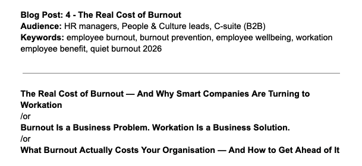

Burnout has a number. Most organisations just haven't sat down to look it up yet. A 2025 study published in the American Journal of Preventive Medicine put it at somewhere between $4,000 and $21,000 per burned-out employee, per year. Multiply that by your headcount and see what comes back. It's not a wellness problem. It's a business risk. And there are smarter ways to get ahead of it than a mindfulness app.

Here's something worth sitting with for a moment. According to Microsoft's 2025 Work Trend Index, 68% of employees are struggling with the pace and volume of work. Nearly half, 46%, say it's already tipping into burnout. A separate DHR Global survey of 1,500 white-collar workers across North America, Europe, and Asia put that number even higher, at 82%.

These aren't people who can't do their jobs. Most of them are still showing up, still hitting deadlines, still responding to messages. They're just running on empty while they do it. And that costs money — more than most organisations have calculated.

## What burned-out employees actually cost

Research published in early 2025 in the American Journal of Preventive Medicine calculated the cost of burnout per employee at between $4,000 and $21,000 annually. That covers lost productivity, presenteeism, and the slow drag of someone who is physically present but mentally somewhere else entirely.

Then there's turnover. A 2024 Stanford study by economist Nicholas Bloom, published in Nature, found that flexible working arrangements reduce resignations by 33%. Given that replacing an employee costs between 50% and 200% of their annual salary depending on seniority, that's a number worth paying attention to.

And then there's the hardest cost to see coming: the gradual erosion of output quality. Deloitte's 2025 Workforce Intelligence Report found that mental fatigue and cognitive strain have now overtaken workload volume as the leading indicators of burnout. It's not just about hours anymore. It's about what happens to thinking, decision-making, and creativity when someone has been doing the same thing, in the same place, under the same pressure, for too long.

> ## The quiet version nobody's catching
>
> Something is showing up in 2026 research that didn't have a name a few years ago: quiet burnout. Employees who look fine from the outside — in the meetings, responsive, output acceptable — but privately running on empty, and masking it well enough that nobody catches it until it becomes something harder to fix.
>
> Only 21% of US and Canadian employees believe their employer genuinely cares about their mental health, according to Meditopia's 2025 research. Four out of five workers are navigating their stress in professional silence. The problem can start with the environment — the same desk, the same commute, or the same home setup. Familiarity, without recovery, is where burnout quietly builds.

## Why a change of environment is more than a nice idea

We already know this intuitively, even if most organisations haven't acted on it yet. The best ideas rarely happen at a desk. They happen on a walk, in a café in a city you don't know that well yet, somewhere that asks your brain to pay attention again. New environments engage the mind differently. This isn't a wellness argument. It's a performance argument, and there's solid research behind it.

Workation makes this practical. An employee works from a different location for a defined period. The job doesn't change. The deliverables don't change. The availability doesn't change. What changes is the environment, and with it, the ability to think clearly again.

People who come back from a workation don't just feel better. They tend to make better decisions, move faster on problems that had stalled, and show the kind of re-engagement that no subscription platform has yet managed to deliver consistently.

## How to build this into a benefits package

The good news is that workation doesn't require rebuilding your HR strategy. It fits alongside what most organisations already offer, and there are two practical ways to make it work.

The financial model sets a workation budget per person or as a shared team allowance, used alongside their standard holiday allowance, not instead of it. The organisational model designates a fixed number of workation days per year — same job, same expectations, just from a different location for a set period.

Both models work. What matters is that workation is framed as a structured commitment, not an informal permission. Structure is what turns a good idea into a real benefit — and both send the same message that no app or subscription can replicate: we trust you.

## The honest case for workation in 2026

Burnout isn't a personal failing. It's what happens when an environment stops giving people what they need to sustain good work, and nothing changes until the cost becomes impossible to ignore.

The organisations taking this seriously aren't doing it out of altruism. They're doing it because preventing burnout is cheaper than managing its consequences, retained employees outperform replaced ones, and the people doing the best work tend to be the ones who feel trusted enough to work differently. Workation won't fix everything. But it addresses the environment directly — and the environment is where most of the problem lives.

## How HelloWale can support you

Finding the right workation location is half the work. HelloWale does it for you. Every location in the HelloWale collection has been personally visited and assessed for what a real working day requires: reliable connectivity, proper ergonomics, a dedicated workspace, and the kind of setting that makes better thinking possible. [Find the right location for your team.](/hello-wale/companies)

## Sources

- American Journal of Preventive Medicine, "The Health and Economic Burden of Employee Burnout to U.S. Employers," 2025 — [ajpmonline.org](https://www.ajpmonline.org/article/S0749-3797(25)00023-6/abstract)
- Microsoft Work Trend Index 2025, via DHR Global — [dhrglobal.com](https://www.dhrglobal.com/news/microsoft-work-trend-index-2025-shows-workplace-capacity-strain/)
- Deloitte, Workforce Intelligence Report, 2025
- Meditopia, Employee Burnout Statistics 2026 — [meditopia.com](https://meditopia.com/en/forwork/articles/employee-burnout-statistics)
- Bloom, N., Han, R., Liang, J. "Hybrid working from home improves retention without damaging performance." Nature, 2024, via ScienceDaily — [sciencedaily.com](https://www.sciencedaily.com/releases/2024/06/240612113235.htm)
