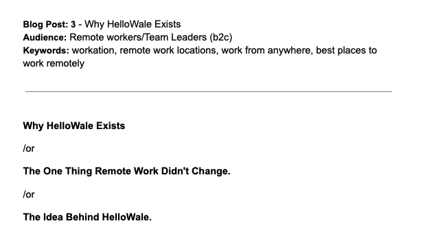

Workation to atrakcyjny, nowoczesny i coraz bardziej pożądany benefit wellbeingowy. Jego wprowadzenie wymaga jednak przygotowania po stronie organizacji oraz dopełnienia formalności i ustalenia szczegółów z pracownikiem. Wiele zależy też od tego, czy workation odbywa się w Polsce, czy za granicą.

Dlaczego kraj świadczenia pracy ma aż takie znaczenie? Ponieważ wpływa na odpowiedzialność pracodawcy w zakresie ubezpieczenia społecznego, bezpieczeństwa i organizacji pracy, ochrony danych, a czasem także podatków. Dlatego wiele firm podchodzi do workation ostrożnie i szczegółowo analizuje wnioski pracowników dotyczące takiej formy pracy.

## Workation w Polsce: mniej zagrożeń, więcej przewidywalności

Z perspektywy pracodawcy workation realizowane na terenie Polski jest zazwyczaj prostsze niż praca zdalna z zagranicy. Nie znika oczywiście potrzeba uzgodnienia miejsca wykonywania pracy w kraju, jednak firma funkcjonuje w tym samym systemie prawnym, podatkowym i ubezpieczeniowym. Ogranicza to liczbę niewiadomych i ułatwia przygotowanie zasad takiego benefitu.

W praktyce krajowe workation może być dobrym kompromisem między potrzebą elastyczności a bezpieczeństwem organizacyjnym. Pracownik zyskuje zmianę otoczenia — możliwość pracy bliżej natury czy z innego miasta — i szansę na regenerację po godzinach, a pracodawca unika wielu wyzwań, które pojawiają się w przypadku pracy z innego państwa.

### Przykład: 4 tygodnie pracy z Bieszczad

**Ustal miejsce pracy.** Zgodnie z przepisami dotyczącymi pracy zdalnej pracodawca musi wiedzieć, gdzie pracownik realizuje swoje obowiązki. Ma to znaczenie nie tylko formalne, ale także ze względu na BHP — pracodawca wciąż odpowiada za warunki pracy. Pracownik powinien więc mieć zapewnione bezpieczne i odpowiednie warunki do wykonywania swoich zadań, w tym ergonomiczne stanowisko pracy, możliwość pracy w skupieniu oraz stabilny dostęp do internetu.

**Zadbaj o bezpieczeństwo danych.** Upewnij się, że pracownik zna i deklaruje przestrzeganie zasad ochrony danych zgodnie ze standardami obowiązującymi w organizacji. W praktyce, obok łączenia się przez VPN, chodzi głównie o logowanie wyłącznie do zaufanych i zabezpieczonych sieci, czyli np. unikanie otwartego Wi-Fi w kawiarniach. Pracownik powinien też wiedzieć, komu i w jaki sposób natychmiast zgłosić zgubienie sprzętu lub podejrzany incydent.

**Określ godziny dostępności pracownika.** Chodzi o zapewnienie ciągłości pracy zespołu i utrzymanie płynnej komunikacji, niezależnie od lokalizacji. Warto wspólnie ustalić godziny, w których pracownik będzie zawsze osiągalny (np. od 10:00 do 14:00), a poza tymi godzinami określić oczekiwany czas reakcji na wiadomości od zespołu.

**Przygotuj „plan B".** W praktyce nie zawsze wszystko przebiega zgodnie z planem. Mogą pojawić się sytuacje, które uniemożliwiają wykonywanie pracy, np. problemy techniczne, zdarzenia losowe czy lokalne ograniczenia. Warto wcześniej ustalić z pracownikiem obowiązek zgłoszenia takich sytuacji oraz możliwe scenariusze działania, takie jak zmiana miejsca wykonywania pracy, powrót do standardowego miejsca i trybu pracy lub wykorzystanie urlopu.

## Workation za granicą: atrakcyjne, ale bardziej złożone

Taki wyjazd należy rozpatrywać nie tylko przez pryzmat prawa pracy, lecz także podatków, ubezpieczeń społecznych, prawa imigracyjnego, ochrony danych oraz bezpieczeństwa pracy. Jak wskazuje PwC, praca zdalna z zagranicy może wpływać na rezydencję podatkową pracownika, sposób opodatkowania jego dochodu oraz obowiązki pracodawcy jako płatnika.

Nie każdy krótki wyjazd od razu powoduje konsekwencje podatkowe, jednak nie można zakładać, że pozostaje on neutralny. Przykładowo, wyjazd zagraniczny trwający kilka tygodni, np. około czterech, często nie zmienia zasad rozliczeń. W wielu krajach istotny staje się dopiero dłuższy pobyt, przekraczający około 183 dni w roku, choć obowiązki podatkowe mogą pojawić się wcześniej.

Kluczowe znaczenie mają m.in. kraj pobytu, długość wyjazdu, status rezydencji podatkowej pracownika, treść umów o unikaniu podwójnego opodatkowania oraz lokalne przepisy. W niektórych sytuacjach pracownik może nadal rozliczać całość dochodów w Polsce, jednak w innych może pojawić się obowiązek rozliczenia także w kraju, z którego faktycznie świadczy pracę.

Ryzyko dotyczy również samego pracodawcy. Regularna lub długotrwała praca pracownika z innego kraju może w określonych przypadkach rodzić pytania o obowiązki firmy w tym państwie, w tym o konieczność rejestracji, opłacanie składek lub potencjalne zobowiązania podatkowe. Przepisy w tym obszarze stale się zmieniają — to, że dziś dany kraj pozwala pracować zdalnie na określonych zasadach, nie znaczy, że za kilka miesięcy będzie tak samo. Aktualne zasady warto sprawdzać tuż przed każdym wyjazdem.

## Ubezpieczenia społeczne: w UE łatwiej, ale nie zawsze prosto

W przypadku pracy zdalnej z krajów Unii Europejskiej sytuację częściowo porządkują wspólne zasady koordynacji systemów zabezpieczenia społecznego. Zgodnie z nimi pracownik powinien podlegać ubezpieczeniom tylko w jednym państwie.

Od 1 lipca 2023 roku obowiązuje też umowa ramowa dotycząca transgranicznej pracy zdalnej, do której przystąpiła Polska. W określonych sytuacjach pozwala ona pracownikowi wykonywać pracę zdalną za granicą przez część czasu — zwykle do około połowy czasu pracy — i nadal podlegać ubezpieczeniu w kraju pracodawcy.

Nadal trzeba sprawdzić, czy dany kraj jest stroną porozumienia, jaki procent pracy wykonywany jest zdalnie za granicą oraz czy spełnione są warunki zastosowania tych zasad. W praktyce oznacza to, że workation w UE może być łatwiejsze do ułożenia niż praca z kraju spoza UE, ale nadal wymaga sprawdzenia formalności przed wyjazdem.

## Workation jako benefit: tak, ale ze świadomym podejściem do realiów prawnych

Workation może być wartościowym benefitem wellbeingowym, ale nie powinno opierać się na haśle „pracuj skąd chcesz". Najlepiej działa wtedy, gdy łączy swobodę pracownika z odpowiedzialnością organizacji. Właśnie dlatego krajowe workation może być rozsądnym pierwszym krokiem dla firm, które chcą wspierać elastyczność, ale nie są jeszcze gotowe na pełną obsługę transgranicznej pracy zdalnej.

Polska oferuje wiele miejsc sprzyjających pracy i regeneracji — blisko natury, bez zmiany jurysdykcji i bez dodatkowej warstwy formalności, która pojawia się przy pracy z zagranicy. Workation nie musi więc oznaczać wyjazdu na drugi koniec świata. Czasem wystarczy dobrze przygotowane miejsce w kraju, jasne zasady i zaufanie między pracownikiem a pracodawcą.

*Ten tekst przedstawia ogólne zasady organizacji pracy w trakcie workation. W konkretnych przypadkach warto sprawdzić swoją sytuację z prawnikiem lub doradcą podatkowym.*

## W czym Cię wesprze HelloWale

Na naszej stronie znajdziesz oferty miejsc idealnych na zespołowe i indywidualne workation — zarówno blisko natury, jak i w mieście. Zawsze z gwarancją dobrych warunków do pracy. [Znajdź odpowiednie miejsce dla swojego zespołu.](/hello-wale/companies)

## Źródła

- Mobilna Faktura, „Workation 2026: rozliczenie pracy zdalnej za granicą," 2026 — [mobilna-faktura.pl](https://mobilna-faktura.pl/blog/2026-04-07-workation-2026-rozliczenie-pracy-zdalnej-za-granica/)
- PwC Studio, „Praca zdalna z zagranicy – jakie konsekwencje podatkowe i ubezpieczeniowe?," 2024 — [studio.pwc.pl](https://studio.pwc.pl/aktualnosci/preferencje-w-pit/pl/praca-zdalna-z-zagranicy)
- EESC, „Taxation of cross-border teleworkers globally and the impact on the EU," 2024 — [eesc.europa.eu](https://www.eesc.europa.eu/en/news-media/press-summaries/taxation-cross-border-teleworkers-globally-and-impact-eu)
- Staniek and Partners, „Praca zdalna z zagranicy – gdzie jest miejsce wykonywania pracy i jakie ma skutki prawne?," 2026 — [staniekandpartners.pl](https://staniekandpartners.pl/blog/praca-zdalna-z-zagranicy-gdzie-jest-miejsce-wykonywania-pracy-i-jakie-ma-skutki-prawne/)
- LEXAI, „Workation – ZUS, podatki i prawo pracy w świetle praktyki i przepisów," 2026 — [lexai.pl](https://lexai.pl/lex-ai-cases/workation-zus-podatki-i-prawo-pracy-w-swietle-praktyki-i-przepisow/)
