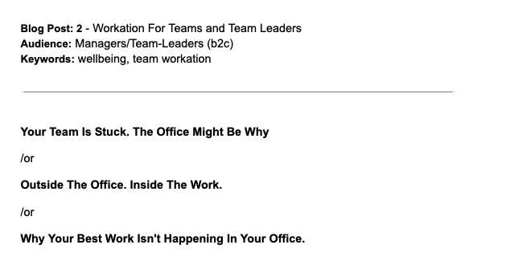

Wielu z nas zna historie narodzin amerykańskich gigantów technologicznych, które zaczynały w nieformalnych miejscach – garażach. To właśnie tam powstawały idee i produkty, które z czasem przynosiły fortuny ich twórcom. Może też masz projekt, który potrzebuje przestrzeni, aby nabrać rozpędu, ale biuro nie do końca temu sprzyja?

Spotkania są efektywne, zadania wykonywane na czas, a mimo to zespołowi brakuje świeżych pomysłów. Dyskusje nie wychodzą poza znane schematy, a rozwój produktów lub usług wyraźnie zwalnia. Praca z biura lub home office sprzyja rutynie, a ta często prowadzi do powtarzalnych sposobów myślenia. Zmiana miejsca pracy może zadziałać jak mentalny reset.

Może czas sięgnąć po nieoczywiste rozwiązanie – wspólne workation dla zespołu, blisko natury, które połączy pracę i kreatywność? Gdy zespół wychodzi z biura do mniej formalnego otoczenia, hierarchie słabną, rozmowy stają się bardziej partnerskie, a pomysły – odważniejsze.

## Blisko natury – więcej kreatywności i prawdziwa regeneracja

Las, jezioro czy góry nie są tylko tłem – mogą stać się częścią procesu pracy. Naturalne otoczenie daje prawdziwy oddech od codziennych bodźców. Spacery i rozmowy podczas wyjścia na zewnątrz pozwalają spojrzeć na problem z szerszej perspektywy.

Zwolennikiem spacerów był Steve Jobs, twórca marki Apple. Potrafił spacerować godzinami – czasem sam, ale często zapraszał osoby, z którymi chciał omówić istotny projekt lub ustalić szczegóły ważnej umowy.

Coraz większą popularność zyskuje także japońska sztuka czerpania energii z przyrody – shinrin-yoku. Dosłownie oznacza kąpiele leśne, czyli uważne spacery wśród drzew. W Japonii ta praktyka stała się na tyle powszechna, że jest elementem pakietów wellbeingowych i ubezpieczeń zdrowotnych oferowanych przez pracodawców – rozwiązaniem, które wielu z nas zapewne chętnie by przyjęło.

> ## Kiedy warto zorganizować wspólne workation i o czym pamiętać
>
> To rozwiązanie może okazać się szczególnie wartościowe, gdy zespół:
>
> - stoi przed wyzwaniem koncepcyjnym lub strategicznym
> - potrzebuje impulsu do rozwoju produktu lub usługi
> - jest zmęczony rutyną i szuka iskry, która pobudzi kreatywność.
>
> Kluczowe jest jasne określenie celu wyjazdu. Nie chodzi o perfekcyjnie rozpisany harmonogram – od tego są warsztaty w biurze. Zespół potrzebuje przestrzeni na myślenie, rozmowę i twórczą pracę. Warto jednak zaplanować czas na pracę zespołową (burze mózgów), indywidualną pracę koncepcyjną oraz zebranie ustaleń. Dobrym pomysłem będzie też wyznaczenie osoby odpowiedzialnej za „pilnowanie celu" i przygotowanie podsumowania efektów pracy – choć warto pamiętać, że Steve Jobs, znany przeciwnik slajdów, raczej nie poleciłby robienia tego w formie prezentacji w PowerPoincie.

## Sposób na integrację zamiast zorganizowanego team buildingu

Wspólne workation ma jeszcze jedną przewagę: integracja dzieje się naturalnie. Bez scenariuszy, atrakcji na siłę i animatorów. Wspólne gotowanie, rozmowy po pracy, spacery czy poranna kawa w innym tempie – to momenty, które budują relacje szybciej niż formalne warsztaty. Warto o tym pomyśleć, jeśli chcesz wzmocnić relacje w nowym lub zmieniającym się zespole.

## Blisko natury, ale z dobrymi warunkami do pracy

Miejsce pobytu powinno mieć swobodny, nieformalny klimat. Warto jednak pamiętać, że workation to nadal czas realnej pracy – tyle że wykonywanej w otoczeniu, które sprzyja nieszablonowemu myśleniu, burzom mózgów i dopracowywaniu koncepcji bez ciągłych przerw i rozproszeń. Dlatego kluczowe jest zapewnienie zespołowi solidnego warsztatu do pracy, dalekiego od garażowej estetyki. Przydadzą się:

- Szybki i niezawodny internet.
- Ergonomiczne krzesła.
- Duży telewizor lub dodatkowe monitory.
- Przestrzeń do pracy zespołowej i indywidualnej.

## Daj zespołowi przestrzeń na myślenie, rozmowę i tworzenie

Gdy wysyłasz mały zespół (2-6 osób) do dobrze przygotowanego, nieformalnego miejsca blisko natury, inwestujesz w nowe idee, lepsze decyzje i szybszy rozwój rozwiązań, które później pracują na wynik całej organizacji. Przy okazji wspierasz wellbeing zespołu. Może więc warto rozważyć, aby takie rozwiązanie na stałe wpisało się do oferty benefitów wellbeingowych w Twojej organizacji?

Czasem najlepszym sposobem na kolejny krok naprzód jest po prostu… wyjście z biura.

## W czym Cię wesprze HelloWale

Na naszej stronie znajdziesz oferty miejsc idealnych na zespołowe workation. Blisko natury i z gwarancją dobrych warunków do pracy. [Znajdź odpowiednie miejsce dla swojego zespołu.](/hello-wale/companies)
